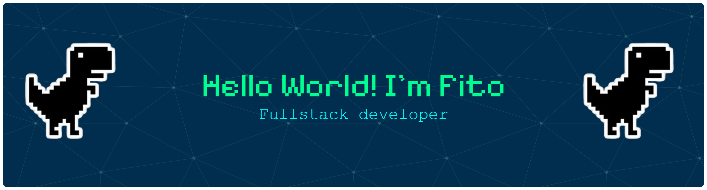

## Hi there! 👋 I'm Fito

<!--
**ItsFito/ItsFito** is a ✨ _special_ ✨ repository because its `README.md` (this file) appears on your GitHub profile.

Here are some ideas to get you started:

- 🔭 I’m currently working on ...
- 🌱 I’m currently learning ...
- 👯 I’m looking to collaborate on ...
- 🤔 I’m looking for help with ...
- 💬 Ask me about ...
- 📫 How to reach me: ...
- 😄 Pronouns: ...
- ⚡ Fun fact: ...
-->

 🔭 I’m currently working on **@Myself**
 
 🌱 I’m currently learning [**Python**]((https://www.python.org/))

 🤔 I’m looking for help with Research Plan and who's to contact for my master degree [lol]

 👯 I’m looking to collaborate on any open source project that include python or C++

 #### Skills
 ##### IDE

 

 ##### Languange

  

 ##### FrameWork  

   

#### Reach Me!!!!
  

 <picture>
  <source media="(prefers-color-scheme: dark)" srcset="https://raw.githubusercontent.com/ItsFito/ItsFito/output/pacman-contribution-graph-dark.svg">
  <source media="(prefers-color-scheme: light)" srcset="https://raw.githubusercontent.com/ItsFito/ItsFito/output/pacman-contribution-graph.svg">
  
</picture>

